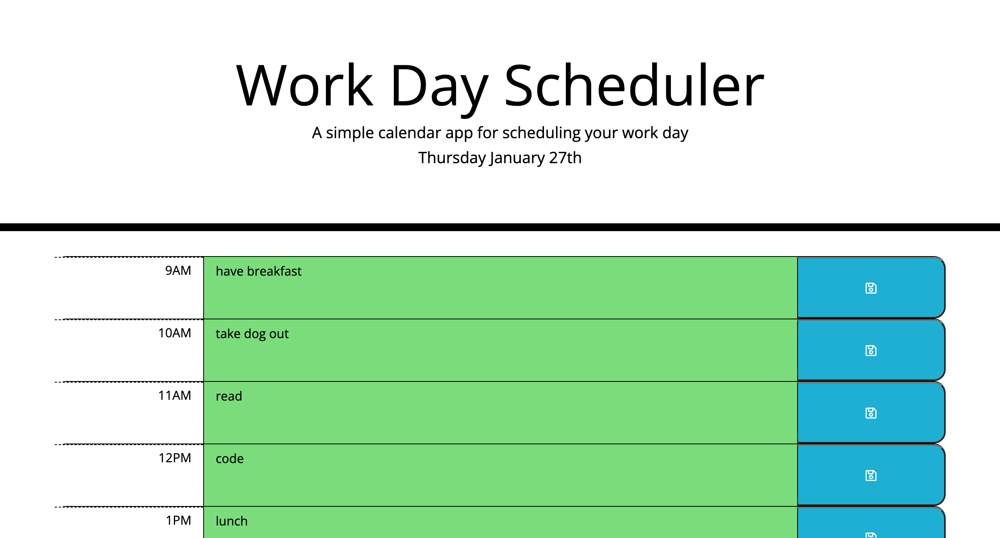

# Work Day Planner
     

## Description 
A browser based calendar application that allows a user to save events for each hour of the day. Each time block is color-coded to indicate whether it is in the past, present, or future based on the current time.

 ### This project can be found:

- [GitHub Repository](https://github.com/codemasterdev/day-planner)
- [Live Deployment](https://codemasterdev.github.io/day-planner)

## Technologies

> The following were used in this project:

- `HTML`
- `CSS`
- `Bootstrap`
- `Git`
- `GitHub`
- `JavaScript`
- `Moment.js`
- `Jquery`
- Coded with `VS Code`

## Contribution
Made with ❤️ by [Devon Webster]

## Images

